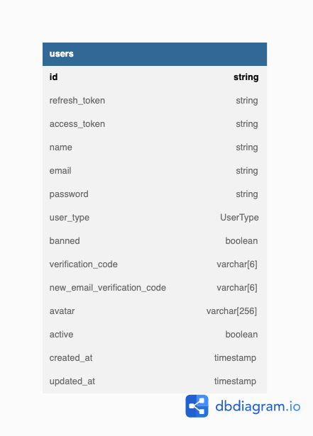

> ## Database Model

> ## Use Cases

1. [Create Account](./requirements/create-account/create-account.md)
2. [Active Account](./requirements/active-account/active-account.md)
3. [Recover Password](./requirements/recover-password/recover-password.md)
4. [Recover Password Callback](./requirements/recover-password-callback/recover-password-callback.md)
5. [Update Account](./requirements/update-account/update-account.md)
6. [Delete Account](./requirements/delete-account/delete-account.md)
7. [Upload Account Image](./requirements/update-account-image/update-account-image.md)
7. [Auth Account](./requirements/auth-account/auth-account.md)
7. [Auth Social](./requirements/auth-social/auth-social.md)
